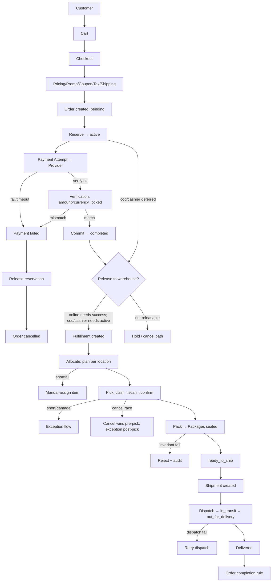

# COMMERCE FAILURE RECOVERY (Phase 1 Lock — includes master diagram)

> Status: LOCKED.

## 1. Matrix (state → retry → idempotency → compensation → manual → audit)

| Failure | State | Retry | Idempotency | Compensation | Manual | Audit |
|---|---|---|---|---|---|---|
| Callback timeout after gateway paid | txn pending, order active | reconcile 15min re-verify | token+status | none (completes) | ops re-fire | PaymentSucceeded late |
| Fulfillment create failed | released, no row | queued retry w/ key | unique order+wh | none | supervisor trigger | create attempts |
| Allocation failed | fulfillment pending | retry; manual-assign item | recompute | none | assign location | allocation log |
| Pick fail / worker disconnect | task assigned, lease expires | auto-release → pool | op_seq dedupe | none | reassign | scan log |
| Cancel during picking | cancelling | claim fulfillment row first | terminal guard | unpicked void; picked → exception/re-putaway | supervisor | cancel audit |
| Seal ok, shipment create failed | ready_to_ship | retry w/ key | shipment key | none | create manually | shipment attempts |
| Dispatch failed | label_created | retry dispatch | carrier id | void label | new label | dispatch log |
| Duplicate webhook | terminal | ignored | event-id dedupe | none | — | replay counter |
| Payment failed / expired | failed / released | new attempt allowed | new attempt row | release reservation | — | fail reason |

## 2. Master end-to-end diagram (with failure branches)

