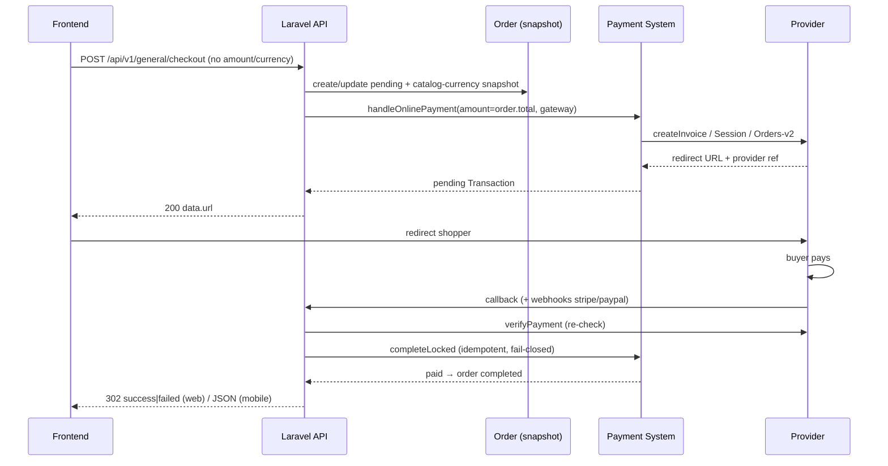
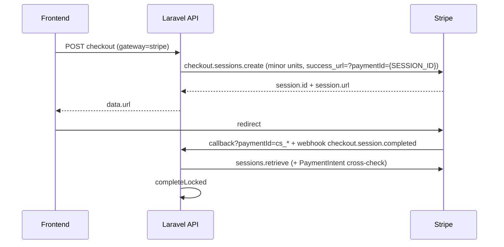
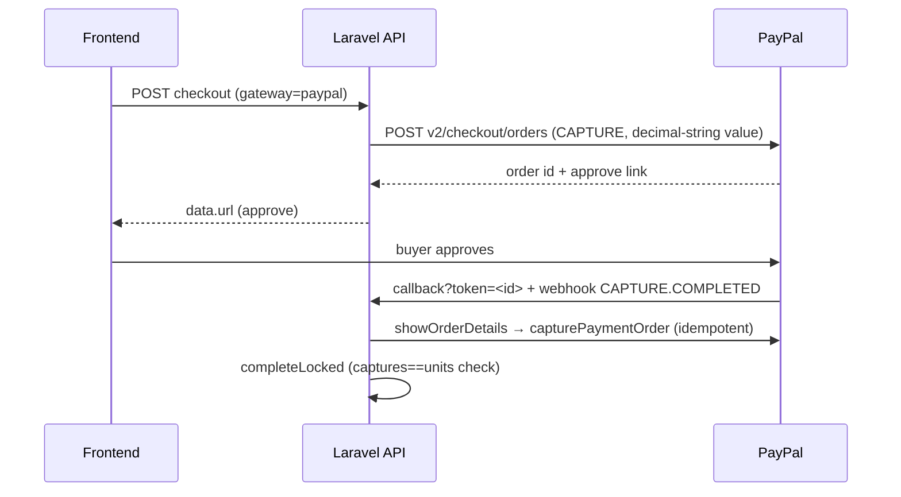

# Payment API — Frontend Integration Documentation

> **Source-of-truth rule:** every statement below is derived from the current
> repository source (`D:\work\meem`). Each behavior cites its source file and
> class/method. Anything that could not be proven from code is explicitly
> marked `NOT PROVEN FROM CURRENT SOURCE`. No production code was changed to
> produce this document (READ → TRACE → VERIFY → DOCUMENT only).

---

## 1. Executive Summary

- The **only** frontend checkout entry point is
  `POST /api/v1/general/checkout` (Sanctum auth). One request creates (or
  reuses) a `pending` Order **and** initializes the online payment.
- The frontend sends **no `amount` and no `currency`**. Both are derived
  server-side from the Order. Unknown fields are ignored by validation.
- Payment currency is **always the Admin catalog currency snapshot** stored
  on the order (`catalog_currency_code` / `currency_code`). The `X-Currency`
  header and user currency preference affect **display only** and are never
  consumed by the payment path.
- Gateway is chosen by the `gateway` request field (`myfatoorah` default),
  gated by `PaymentGatewayRegistry::canInitiate()` (enabled + configured +
  `online` method + currency support). Disabled/unsupported → `422`.
- Online gateways return a **redirect URL** (`data.url`); the frontend
  redirects the shopper there. Verification, capture, and order completion
  are **100% backend** (browser callback + provider webhooks). There is
  **no frontend verification endpoint to call**.
- `type: "mobile"` in the checkout body switches the browser-callback
  responses from 302 redirects to JSON (for in-app flows).
- MyFatoorah = browser-callback only (no webhook). Stripe + PayPal =
  browser-callback **and** signed provider webhooks.

---

## 2. Current Payment Architecture

```
POST /api/v1/general/checkout  (auth:sanctum)
        ↓
App\Http\Controllers\Api\General\OrderController@checkout
        ↓  OrderCreateRequest (validation)
App\Services\General\OrderService@addItemsInOrder
        ↓  creates/updates Order (status=pending) + reservation
App\Services\Checkout\OrderCreationService  (totals + currency snapshot)
        ↓
App\Services\Payment\PaymentCheckoutHandler@handleOnlinePayment
        ↓  PaymentGatewayRegistry::canInitiate  (enable/config/currency gate)
App\Services\Payment\PaymentGatewayFactory@make → registry::resolve
        ↓
Gateway adapter (PaymentGatewayContract)
  App\Services\Gateway\MyFatoorahGateway
  App\Services\Gateway\StripeGateway
  App\Services\Gateway\PayPalGateway
        ↓  provider API (invoice / Checkout Session / Orders v2)
transactions row (status=pending, gateway_transaction_id set)
        ↓
JSON { status, message, success, data: { url } }
        ↓
Frontend redirects shopper to data.url
        ↓  provider hosted page → buyer pays
Return path A (browser):  GET|POST /api/v1/general/checkout/callback
Return path B (server):   POST /api/v1/general/checkout/webhooks/{stripe,paypal}
        ↓  adapter::verifyPayment  (verify path ignores enabled-flag)
App\Services\Payment\PaymentCompletionService::completeLocked  (row locks)
        ↓  idempotency → order-pending → amount×1000/currency/ref checks → commit
transactions.status=paid, orders.payment_status=payment-success,
orders.status=completed + PaymentSucceeded event
```

> Source: `routes/api.php` (lines 118–143),
> `app/Http/Controllers/Api/General/OrderController.php`,
> `app/Services/Payment/PaymentCheckoutHandler.php`,
> `app/Services/Payment/PaymentCompletionService.php`,
> `app/Providers/RouteServiceProvider.php` (prefix `api`).

---

## 3. Frontend Responsibilities

1. Call `POST /api/v1/general/checkout` with customer/shipping fields +
   `payment_method` (+ `gateway` for online, `type` for mobile).
2. Read `data.url` from a successful online checkout and **redirect** the
   shopper to it (full-page redirect for web).
3. Do **NOT** compute, send, or display-checkout totals as payment input;
   do **NOT** send `amount`, `total`, `price`, `currency`, or
   `currency_code`.
4. Do **NOT** choose/settle currency (no `X-Currency` effect on payment).
5. After redirect, do nothing: the backend callback completes the order
   (web: backend 302s to `{frontend}/{locale}/payment/success|failed`;
   mobile: the initiating `type=mobile` yields JSON instead).
6. Never call admin/staff endpoints (`mark-paid`, `refund`,
   `payment-gateways`).

---

## 4. Backend Responsibilities

- Cart → totals → tax/shipping → Order (pending) + inventory reservation.
- Currency snapshot, amount derivation, gateway gating, invoice/session/
  order creation at the provider.
- Storing the `pending` transaction with provider reference.
- Verifying payment server-side (callback re-verification, webhook
  signature verification, capture for PayPal).
- Fail-closed amount (×1000) / currency / provider-ref checks.
- Idempotent completion, coupon/promotion finalization, invoice creation,
  success/failure events, and redirect/JSON responses.

---

## 5. API Endpoint Inventory

Base: `RouteServiceProvider` prefixes `routes/api.php` with `/api`.

| # | Method | URL | Auth | Purpose | Status |
|---|--------|-----|------|---------|--------|
| 1 | POST | `/api/v1/general/checkout` | `auth:sanctum` + `throttle:authenticated` | Create order + init payment (**the** frontend entry) | CURRENT |
| 2 | GET | `/api/v1/general/checkout/promotions` | `auth:sanctum` | Eligible promotions preview (not payment) | CURRENT |
| 3 | GET/POST | `/api/v1/general/checkout/callback` | public (`api` + `throttle:public-api` + `throttle:payment-callback` 20/min/IP) | Browser return (success URL for all gateways) | CURRENT |
| 4 | GET/POST | `/api/v1/general/checkout/error-callback` | public (same throttles) | Browser return (cancel/failure URL for all gateways) | CURRENT |
| 5 | POST | `/api/v1/general/checkout/webhooks/stripe` | public, Stripe-Signature verified | Stripe server events | CURRENT |
| 6 | POST | `/api/v1/general/checkout/webhooks/paypal` | public, PayPal signature verified | PayPal server events | CURRENT |
| 7 | POST | `/api/v1/general/checkout/cod/{orderId}/mark-paid` | `auth:sanctum` + `permission:payments.mark_paid` | Staff confirms COD cash receipt | CURRENT, staff only — frontend MUST NOT call |
| 8 | POST | `/api/v1/general/checkout/cashier/{orderId}/mark-paid` | `auth:sanctum` + `permission:payments.mark_paid` | Staff confirms cashier receipt | CURRENT, staff only — frontend MUST NOT call |
| 9 | POST | `/api/v1/admin/payments/{order}/refund` | `auth:sanctum` + `permission:payments.refund` | Admin gateway refund | CURRENT, admin only |
| 10 | GET/PUT | `/api/v1/admin/payment-gateways[/{code}]` | `auth:sanctum` + settings permissions | Gateway enable/disable + view | CURRENT, admin only |
| 11 | POST | `/api/v1/general/fast-shipping/checkout` | `auth:sanctum` | Separate fast-shipping order flow | CURRENT, related — payment details NOT PROVEN FROM CURRENT SOURCE (not traced) |
| 12 | (legacy) | `/orders/checkout/verify` (documented path on `Marvel\Http\Controllers\CheckoutController@verify`) | NOT PROVEN FROM CURRENT SOURCE (registration in `Rest/Routes.php` not traced) | **Cart verification** (`amount` + `products` → tax/shipping calc). NOT a payment verification endpoint | LEGACY/INTERNAL |

> Source: `routes/api.php` lines 118–143, 243–257;
> `packages/marvel/src/Http/Controllers/CheckoutController.php`;
> `packages/marvel/src/Http/Requests/CheckoutVerifyRequest.php`.

There is **no** `verifyPayment`, `createOrder`, or `capture` endpoint for the
frontend. Payment verification is server-internal
(`PaymentGatewayContract::verifyPayment`, called by callbacks/webhooks).

---

## 6. Checkout / Payment Initialization

### 6.1 Endpoint

```http
POST /api/v1/general/checkout
Authorization: Bearer {sanctum-token}
Accept: application/json
Content-Type: application/json
```

- Controller: `App\Http\Controllers\Api\General\OrderController@checkout`
- Validation: `Marvel\Http\Requests\OrderCreateRequest`
- Middleware: `api`, `auth:sanctum`, `throttle:authenticated`
- Route name: none (unnamed). Source: `routes/api.php:137`.

### 6.2 Chain

```text
POST /api/v1/general/checkout
        ↓
OrderController@checkout
        ↓  OrderCreateRequest (validated)
OrderService@addItemsInOrder  (pending-order reuse §6.5, reservation)
        ↓  OrderCreationService (totals + currency snapshot §12)
PaymentCheckoutHandler@handleOnlinePayment  (online)
  PaymentCheckoutHandler@handleCodPayment  (cod)
  PaymentCheckoutHandler@handleCashierQrPayment  (pay_at_cashier)
        ↓
PaymentGatewayRegistry::canInitiate → PaymentGatewayFactory::make
        ↓
{MyFatoorah,Stripe,PayPal}Gateway::createInvoice → provider API
        ↓
Transaction::create(status=pending)
        ↓
JSON { status, message, success, data }
```

### 6.3 Request fields (exact, from `OrderCreateRequest::rules()` + controller defaults)

| Field | Required | Type | Example | Used by | Notes |
|-------|----------|------|---------|---------|-------|
| `name` | **yes** | string max:255 | `"Sara"` | Order create | |
| `user_phone` | **yes** | string max:255 | `"9659xxxxxxx"` | Order + MyFatoorah `CustomerMobile` | digits-normalized server-side |
| `user_email` | no | email max:255 | `"s@s.com"` | Order + MyFatoorah `CustomerEmail` via `CustomerContactResolver` | |
| `address` | required-if physical cart + `fulfillment_type=delivery` | array | `{...}` | Order | nullable otherwise |
| `governorate_id` | required-if physical cart + delivery | int, exists | `3` | shipping price | |
| `pickup_location_id` | required-if `fulfillment_type=pickup` | int, exists | `7` | pickup snapshot | |
| `fulfillment_type` | no (default `delivery`) | `delivery`\|`pickup` | `"delivery"` | Order | forced `pickup` for `pay_at_cashier` |
| `payment_method` | no (default `online`) | `online`\|`cod`\|`pay_at_cashier` | `"online"` | `OrderController@checkout` branch | `cod`+`pickup` → 422 `COD_NOT_AVAILABLE_FOR_PICKUP` |
| `gateway` | no (default `config('payment.default_gateway')` = `myfatoorah`) | string max:50 | `"stripe"` | `PaymentCheckoutHandler` (online only) | ignored unless `payment_method=online`; stored as `payment_gateway=null` otherwise |
| `type` | no | `mobile`\|`web` | `"mobile"` | callback-mode selector (`_callback_type`) | mobile → callbacks return JSON; web/absent → 302 redirect |
| `notes` | no | string | `".."` | Order | |
| `selected_promotion_id` | no | int, exists:promotions | `12` | totals | |
| `selected_gift_product_id` | no | int, exists:products | `44` | totals | |

> Source: `packages/marvel/src/Http/Requests/OrderCreateRequest.php:28-70`;
> `app/Http/Controllers/Api/General/OrderController.php:102-114`.

### 6.4 Fields the frontend MUST NEVER send

`amount`, `total`, `total_price`, `price`, `payment_amount`, `currency`,
`currency_code`, `catalog_currency_code`, `base_currency_code` — none is a
validation rule, none is read by controller/service. `validated()` strips
them; `$request->only(...)` / explicit `$request->input('payment_method'|
'gateway'|'fulfillment_type')` ignore them. Sending them has **no effect**
(they are silently dropped), and no server check compares a client amount.

### 6.5 One request = order + payment; retries reuse the pending order

`OrderService@addItemsInOrder` looks up
`OrderCreationService::findPendingOrderForUser(userId)` (`status=pending`,
`lockForUpdate`). If a pending order exists (e.g. a previous checkout whose
payment failed/expired), it is **updated** (not duplicated): items re-synced,
old inventory + coupon reservations released, new reservation taken.
Otherwise a new order is created.

> Source: `app/Services/General/OrderService.php:244, 283-311`.

### 6.6 Responses (envelope: `Marvel\Traits\ApiResponse`)

All JSON responses use `{ status: <http-code>, message: <translated>,
success: bool, data?: {...} }` — NOT the `{success,message,data,meta}`
shape. Exception: `OrderCreateRequest` validation failure returns the raw
validator errors object with HTTP 422 (no envelope).

> Source: `packages/marvel/src/Traits/ApiResponse.php:9-22`;
> `OrderCreateRequest::failedValidation()`.

| Case | HTTP | Envelope | `data` |
|------|------|----------|--------|
| Online success | 200 | `success:true`, message `Checkout successful` | `{ url: "<provider redirect>" }` |
| Zero-value online (§6.7) | 200 | `success:true`, `Checkout successful` | `{ order_id }` — **no `url`** |
| COD success | 200 | `success:true`, message `checkout.cod_success` | `{ order_id }` |
| Cashier success | 200 | `success:true`, `Checkout successful` | `{ order_id }` |
| Empty/missing cart | 400 | `success:false`, `Cart not found` | — |
| Validation failure | 422 | raw errors object | — |
| `cod`+`pickup` | 422 | `COD_NOT_AVAILABLE_FOR_PICKUP` | — |
| Unknown `payment_method` | 422 | `INVALID_PAYMENT_METHOD` | — |
| Gateway disabled/misconfigured | 422 | `PAYMENT_GATEWAY_UNAVAILABLE` | — |
| Order currency unsupported | 422 | `PAYMENT_CURRENCY_UNSUPPORTED (:currency)` | — |
| Provider invoice failure | 500 | `ERROR_CREATING_INVOICE` | — |
| Transaction persist failure | 500 | `ERROR_CREATING_TRANSACTION` | — |

> Source: `OrderController@checkout` (lines 92–154),
> `PaymentCheckoutHandler` (all three handlers), message keys
> `resources/lang/en/message.php`, constants
> `packages/marvel/config/constants.php`.

### 6.7 Zero-value online orders (D-05)

If the rounded order total is `<= 0` with `payment_method=online`, **no
provider is called**: a `paid` zero-amount `online` transaction
(`gateway_response: {zero_value:true, gateway}`) is stored and the order
completes through the canonical path (inventory, coupons, promotions,
invoice, `PaymentSucceeded`). Gateway enabled-state is irrelevant, but the
currency must still be gateway-supported or it 422s.

> Source: `OrderController@checkout:129-143`,
> `OrderController@completeZeroValueOnlineOrder:167-215`.

### 6.8 Frontend action after checkout

1. Online + `data.url` present → redirect shopper to `data.url`.
2. Online + `data.order_id` only (zero-value) → treat as paid, show success
   (order id returned).
3. COD / cashier → show “order placed” (payment completes later by staff).
4. Never construct provider URLs; never poll a verification endpoint (none
   exists for the frontend).

---

## 7. Stripe API

### 7.1 Endpoint

Same as §6.1 with `"gateway": "stripe"` (or admin default). No
Stripe-specific frontend endpoint exists.

### 7.2 Request

§6.3 fields with `payment_method: "online"`, `gateway: "stripe"`. No
amount/currency fields.

### 7.3 Backend → Stripe (exact)

`StripeGateway::createInvoice(Order $order, float $amount, $callbackUrl,
$errorUrl)`:

- Currency: `$orderCurrency = PaymentCurrencyResolver::forOrder($order)`;
  fail-closed `PAYMENT_CURRENCY_UNSUPPORTED` if
  `supportsCurrency()` (config `payment.gateways.stripe.supported_currencies`)
  rejects it. `amount <= 0` → `Invalid payment amount`.
- Minor units: `toMinorUnits($amount, $currency)` — zero-decimal list
  (`BIF,CLP,DJF,GNF,JPY,KMF,KRW,MGA,PYG,RWF,UGX,VND,VUV,XAF,XOF,XPF`) sent
  as-is; `BHD,JOD,KWD,OMR,TND` ×1000; all others ×100 (delegates to
  `CurrencyPrecision`).
- Creates a **Checkout Session** (`mode=payment`, one line item
  `Order #<id>`, `unit_amount`, lowercase currency), `success_url =
  <callback>?paymentId={CHECKOUT_SESSION_ID}`, `cancel_url =
  <error-callback>?paymentId={CHECKOUT_SESSION_ID}`, `metadata.order_id`.
- Persists only allowlisted session fields (`id,url,status,payment_status,
  amount_total,currency`) in `gateway_response` (+ `_callback_type`).
- Returns `redirectUrl = session.url`, `gatewayTransactionId = session.id`.

> Source: `app/Services/Gateway/StripeGateway.php:73-155`.

### 7.4 Response / redirect flow

`data.url` = Stripe Checkout URL (`redirectUrl`). Frontend redirects there;
Stripe hosts the payment page. Secrets never leave the backend (secret key
from `payment.gateways.stripe.secret_key`; error messages redacted of
`sk_live_/sk_test_` material).

### 7.5 Callback

Unified `checkout/callback` (§14). `paymentId` = `{CHECKOUT_SESSION_ID}`
appended by Stripe. Gateway resolved from the stored transaction
(`payment_method=stripe`).

### 7.6 Verification (`StripeGateway::verifyPayment`)

Retrieve Checkout Session → paid iff `payment_status === 'paid'`; if a
`payment_intent` is referenced, the PaymentIntent is retrieved and its
currency/amount must equal the session's, else `failed` with
`Payment amount or currency mismatch`. Returns major-unit amount +
uppercase currency for the completion checks.

> Source: `StripeGateway.php:157-238`.

### 7.7 Completion

Canonical `PaymentCompletionService` (§15). Refund path (admin-only):
`refunds->create(payment_intent, amount-minor-units)`; success **only** when
Stripe reports `succeeded`.

### 7.8 Errors (frontend-visible)

- `422` `PAYMENT_CURRENCY_UNSUPPORTED` (registry or adapter gate).
- `500` `ERROR_CREATING_INVOICE` / gateway `Invalid gateway response`.
- Callback failure → web 302 to `/payment/failed`, mobile JSON (§14.4).

---

## 8. PayPal API

### 8.1 Endpoint

Same as §6.1 with `"gateway": "paypal"`. No PayPal-specific frontend
endpoint exists.

### 8.2 Request

§6.3 fields with `payment_method: "online"`, `gateway: "paypal"`.

### 8.3 Backend → PayPal (exact)

`PayPalGateway::createInvoice()` over `srmklive/paypal` (Orders v2):

- `intent: CAPTURE`; `purchase_units[0] = { reference_id: "order-<id>",
  invoice_id: "<orderId>", amount: { currency_code, value } }` where `value`
  is a **decimal string at the currency exponent**
  (`CurrencyPrecision::formatForGateway`, e.g. `13.255` KWD, `10.50` USD).
- `application_context = { return_url: <callback> (unchanged),
  cancel_url: <error-callback> }`.
- Idempotency header `PayPal-Request-Id: order-<id>-<attempt>`
  (`payment_attempt` metadata, default 1).
- Mode/credentials from `payment.gateways.paypal` (`mode` sandbox|live,
  `client_id`, `client_secret`); OAuth via SDK `getAccessToken()`.
- Returns the link with `rel=approve` as `redirectUrl`,
  PayPal order id as `gatewayTransactionId`. Stored response allowlisted to
  `id,status,intent,amount,currency` (no payer PII).
- Note: the SDK `setCurrency()` guard mirrors PayPal-supported currencies
  (no KWD/SAR/…); a config-allowed but SDK-rejected currency throws at
  client build and fails closed (→ 422 at checkout). `supportsCurrency()`
  itself reads only the config allowlist.

> Source: `app/Services/Gateway/PayPalGateway.php:86-171` + class docblock.

### 8.4 Approval flow (frontend)

Frontend opens/redirects to the returned approval URL. Buyer approves at
PayPal; PayPal appends `?token=<paypalOrderId>&PayerID=…` to the
`return_url`, landing on the unified callback. **The frontend does NOT send
the PayPal order id back and calls no second API** — correlation uses the
stored `gateway_transaction_id`.

### 8.5 Callback

Unified `checkout/callback` (§14).

### 8.6 Capture

Unlike MyFatoorah (read-only check), `PayPalGateway::verifyPayment()`
**performs the capture**: `showOrderDetails(id)` → `APPROVED` →
`capturePaymentOrder` (idempotent key `capture-<id>`) →
`completedResult` (all captures `COMPLETED` and capture-total ==
purchase-unit-total at the currency exponent, else `success:false`).
`COMPLETED` → paid result. `ORDER_ALREADY_CAPTURED` race → re-fetch;
`COMPLETED` still succeeds. Anything else → `Payment not completed`.

> Source: `PayPalGateway.php:173-243, 454-564`.

### 8.7–8.9 Verification / completion / errors

Canonical completion (§15). Refund (admin-only) succeeds only on explicit
provider `COMPLETED` status; ambiguous/missing/non-completed captures fail
closed. Frontend-visible errors mirror §7.8 (422 currency, 500 provider).

---

## 9. MyFatoorah API

- Endpoint: §6.1 with `"gateway": "myfatoorah"` (also the default gateway:
  `config('payment.default_gateway')`, env `DEFAULT_PAYMENT_GATEWAY`).
- `createInvoice`: `InvoiceValue=<order amount>`,
  `DisplayCurrencyIso=<order currency>`, `CallBackUrl`, `ErrorUrl`,
  customer name/mobile (digit-normalized, `+20`-prefix stripped)/email,
  `NotificationOption=LNK`, locale language. Stored response allowlisted to
  technical fields only (`InvoiceId,InvoiceStatus,InvoiceValue,
  DisplayCurrencyIso,InvoiceURL,RefundId,RefundStatus,IsDirectPayment,
  PaymentURL`) — customer PII stripped at source.
- Returns `Data.InvoiceURL` (redirect) + `Data.InvoiceId` (stored as both
  `invoice_id` and `gateway_transaction_id`).
- `verifyPayment`: `checkInvoice { Key: paymentId, KeyType: PaymentId }`;
  paid iff `Data.InvoiceStatus === 'Paid'`.
- **Browser-callback only — no webhook endpoint exists by design**
  (no provider-signed server event; adding an unsigned webhook would widen
  attack surface).

> Source: `app/Services/Gateway/MyFatoorahGateway.php`;
> `app/Http/Controllers/Api/General/PaymentWebhookController.php:27-47`.

---

## 10. Currency Rules

| Concept | Value / authority | Source |
|---------|-------------------|--------|
| **Catalog currency** | Admin setting `settings.options.catalog_currency_code` (`CurrencyService::getCatalogCode()`), changeable via `setCatalogCurrency()` (requires active currency + rate) | `CurrencyService:64-73, 265-305` |
| **Base currency** | Admin setting `base_currency_code`; financial-reporting currency (`converted_total_price`); immutable once completed+paid orders exist | `CurrencyService:53-62, 215-264` |
| **Order currency snapshot** | **Always the catalog code** at creation: `currency_code = catalog_code = catalogCode`, `base_currency_code = baseCode`, plus `currency_rate/date`, `converted_total_price` | `OrderCreationService::resolveCurrencySnapshot:414-443` |
| **Payment currency** | `PaymentCurrencyResolver::forOrder($order)`: `catalog_currency_code` → `currency_code` → live catalog code → `config('payment.default_currency','KWD')` | `PaymentCurrencyResolver.php:26-49` |
| **Display/effective currency** | `getEffectiveCode()`: user preference → `X-Currency` header → catalog; **only when** `currency_selection_enabled` (default **false** → always catalog) | `CurrencyService:85-128` |
| **Payment vs display** | Payment path **never calls `getEffectiveCode()`**; `X-Currency`/preference affect only display conversions. Explicitly: payment ignores `X-Currency` | `PaymentCurrencyResolver.php` (no effective-code reference); `UserCurrencyPreferenceService:62-73` |
| **Frozen when** | At order creation/update (`createOrder`/`updateOrder` rewrite the snapshot on retry) | `OrderCreationService:46, 93-103, 160, 212-222` |
| **Reaches Stripe** | Lowercase order currency + minor-unit amount | `StripeGateway:96-97` |
| **Reaches PayPal** | Uppercase order currency + decimal-string value | `PayPalGateway:117-130` |

Do not merge these concepts: catalog ≠ base ≠ display ≠ order snapshot
(though snapshot currently copies catalog).

---

## 11. Amount Rules

- Frontend sends no amount (§6.4). Backend amount =
  `CurrencyPrecision::roundForCurrency(finalTotal + productTax + orderTax +
  shipping + fastShippingFee, catalogCode)` → stored as
  `orders.total_price`; checkout re-rounds to the order exponent and passes
  it to `handleOnlinePayment($request, $order, $orderPrice, $gateway)`.
- Transaction row stores that exact amount + resolver currency.
- No client amount is ever trusted; there is no `client amount != order
  amount` check because no client amount exists.
- Completion enforces it provider-side: `assertNoMismatch` compares
  `round(order.total_price×1000)` vs `round(verified.amount×1000)` (exact
  for ≤3dp currencies precisely because the factor is symmetric), plus
  currency equality and provider-ref ownership of the row. Any divergence
  throws `PaymentMismatchException` → transaction `failed`, order stays
  pending, `PaymentFailed` event.

> Source: `OrderCreationService:36-43`; `OrderController@checkout:132-142`;
> `PaymentCheckoutHandler@handleOnlinePayment`; `Transaction::create` block;
> `PaymentCompletionService:157-264`.

---

## 12. Order Currency Snapshot

Covered in §10. Retry updates (`updateOrder`) rewrite the full snapshot, so
a catalog-currency change between attempts applies to the reused pending
order; the latest pending transaction amount is re-synced via
`OrderCreationService::updateTransactionAmount()`.

---

## 13. Gateway Enable/Disable

- Definition = `config('payment.gateways')` merged with
  `settings.options['payment_gateways']` overrides
  (`GatewaySettingsService`). Only `{enabled, display_name, sort_order}`
  may come from DB (read allowlist); secrets/class/currencies/methods stay
  env-only. Missing settings row → config-only fallback.
- `canInitiate(code,'online',currency)`: unknown → `unknown`; disabled →
  `disabled`; bad class → `unknown`/`misconfigured`; `isConfigured()` false
  (empty secret/key/credentials) → `misconfigured`; method not in
  `methods` → `method_unsupported`; `supportsCurrency()` false →
  `currency_unsupported`.
- Frontend effect: `currency_unsupported` → `422
  PAYMENT_CURRENCY_UNSUPPORTED`; any other `!ok` → `422
  PAYMENT_GATEWAY_UNAVAILABLE`. No provider call is made.
- **Initiate vs verify split**: `canVerify()`/`resolve()` deliberately
  ignore the enabled flag, and callbacks/webhooks resolve via
  `PaymentGatewayFactory::make` (registry `resolve`) — so **in-flight
  payments still verify/complete after a mid-payment disable**. Never gate
  the verify path on `isEnabled` without auditing all callers.
- Admin control: `GET /api/v1/admin/payment-gateways`
  (`permission:view-settings|update-settings`),
  `PUT /api/v1/admin/payment-gateways/{code}`
  (`permission:update-settings`, body `{enabled, display_name?,
  sort_order?}`); secrets never returned.

> Source: `GatewaySettingsService.php`; `PaymentGatewayRegistry.php`;
> `PaymentGatewayFactory.php`; `PaymentCheckoutHandler@handleOnlinePayment`;
> `config/payment.php`.

---

## 14. Callback/Webhook Contract

### 14.1 Browser return — success

```http
GET|POST /api/v1/general/checkout/callback?paymentId={provider-ref}[&type=mobile|web]
```

Public, throttled 20/min/IP (`payment-callback`). No auth, no signature
(the security is the server-side `verifyPayment` re-check, not the hit).

Behavior (`OrderController@checkoutCallback`):

1. `paymentId` required, `^[A-Za-z0-9\-_]+$`, ≤191 chars → else `400
   MISSING_PAYMENT_ID`. `type` (if present) must be `web|mobile` → else
   `400 INVALID_PAYMENT_METHOD`.
2. Transaction lookup by `gateway_transaction_id` **or** `invoice_id`
   (fallback: verified ref). Gateway = `transaction.payment_method`,
   default `myfatoorah`. Resolve via factory (verify path — works while
   disabled).
3. `gateway->verifyPayment(paymentId)`. Unknown local order + verified
   provider payment → **fail-safe failure** (never show success for an
   order that does not exist locally).
4. Verified paid → canonical locked completion (§15). Verified unpaid →
   transaction `failed` (+ `PaymentFailed` event).
5. Response mode = stored `_callback_type` (set at initiation from
   checkout `type`) → request `type` → default `web`.

### 14.2 Browser return — error/cancel

```http
GET|POST /api/v1/general/checkout/error-callback?paymentId={...}[&type=...]
```

Same lookup/validation. Nuance: it **also re-verifies** — if the provider
reports paid (user paid but landed on cancel URL), the order **still
completes** (`error_callback_success_completes_order`, proven by test).
Unpaid → transaction `failed`.

### 14.3 Provider webhooks (server-to-server; frontend does nothing)

| Endpoint | Verification | Events handled |
|----------|--------------|----------------|
| `POST /api/v1/general/checkout/webhooks/stripe` | Raw body vs `Stripe-Signature` using `payment.gateways.stripe.webhook_secret` (via `StripeWebhookVerifier`); empty/unsigned/misconfigured → `400 INVALID_PAYMENT_RESPONSE`; bad signature → `400` | `checkout.session.completed` → re-verify session → canonical completion; `payment_intent.payment_failed` → resolve owning session (persisted `_payment_intent_id` → Stripe `sessions.all(payment_intent)`) → mark `failed`; `refund.*`/`charge.refunded` intentionally **ignored** (refunds reconciled from admin API); unknown → `200 {status:ignored}` |
| `POST /api/v1/general/checkout/webhooks/paypal` | `payment.gateways.paypal.webhook_id` required (else `503 PAYMENT_GATEWAY_UNAVAILABLE`); all five `Paypal-*` transmission headers required (else `400`); SDK `verify-webhook-signature` (else `401`); empty/invalid body → `400` | `PAYMENT.CAPTURE.COMPLETED` → correlate (`supplementary_data.related_ids.order_id` → `invoice_id` → `custom_id` → `id`, first match against local refs) → re-verify → canonical completion; `PAYMENT.CAPTURE.DENIED` → mark `failed`; `PAYMENT.CAPTURE.REFUNDED/REVERSED` → `PaymentRefundService::recordExternalRefund` ledger; unknown → `200 {status:ignored}` |

Both: unknown transaction → `200 ignored` (never 500, so providers stop
retrying dead ends); gateway-mismatch (row’s `payment_method` ≠ webhook
gateway) → `400 INVALID_PAYMENT_METHOD`; re-verification failure on a known
row → mark `failed` and ack `200` (fail-safe terminal ack); event-id dedupe
(`_webhook_event_ids`, capped at 20) + canonical completion guards make
replays safe.

> Source: `PaymentWebhookController.php` (full); `OrderController@checkoutCallback`
> (lines 263–563), `@checkoutErrorCallback` (565–813).

### 14.4 Callback response shapes (exact)

Web (default): `302` to
`{app.app_url_frontend}/{locale}/payment/success?status=success&message=…&payment_id=…&order_id=…`
or `…/payment/failed?status=failed&message=…&payment_id=…` (error-callback
failure path uses `error=` instead of `message=`).

Mobile (`type=mobile`): JSON envelope (§6.6) with:

| Path | HTTP | `success` | `data` |
|------|------|-----------|--------|
| success-callback, paid | 200 | true | `{status:"success", message:PAYMENT_SUCCESSFUL, payment_id, order_id}` |
| success-callback, verify failed | 200 | **true** (`CHECKOUT_SUCCESSFUL`) | `{status:"failed", message, payment_id}` |
| error-callback, verify paid | 200 | true | `{status:"success", message, payment_id}` (no `order_id`) |
| error-callback, verify failed | 400 | false (`PAYMENT_FAILED`) | `{status:"failed", error, payment_id}` |
| unknown order | 400 / 302-failed | false | `{status:"failed", message, payment_id}` |
| amount/currency/ref mismatch | 400 / 302-failed | false | `{status:"failed", message, payment_id}` |
| coupon-blocked | 400 / 302-failed | false | `{status:"failed", message, payment_id}` |

### 14.5 No frontend verification call

After redirect, the frontend waits for the callback landing (web) or reads
the mobile JSON. **Do not call any verify endpoint** — none exists for the
frontend, and provider references are never trusted from the client.

---

## 15. Payment Status Lifecycle

### Transactions (`transactions.status`)

`pending` (initiation) → `paid` (canonical completion; `paid_at` set,
`gateway_response` = allowlisted verify payload preserving
`_callback_type`, `idempotency_key` UUID stamped) **or** `failed`
(verify-failed / mismatch / coupon-blocked / provider failure signal).
Non-pending rows are never touched by completion (replays ignored).

### Orders

`status`: `pending` → `completed` (via `OrderService::changeOrderStatus`,
which also owns coupon usage — a coupon refusal throws
`CouponConsumptionException`, rolls back, transaction marked `failed` but
kept retryable via token rotation). Non-pending orders never re-complete;
a paid signal on a *second* row while completed → `DuplicateHold` +
`PaymentReconciliationResult` (`duplicate_payment`) for manual ops, no
state change.

`payment_status`: `payment-pending` → `payment-success`
(`Marvel\Enums\PaymentStatus::SUCCESS`, = `Order::PAYMENT_STATUS_SUCCESS`
`'payment-success'`); `paid_at` set. Enum also defines
`payment-processing|payment-failed|payment-reversal|payment-refunded|
payment-cash-on-delivery|payment-cash|payment-wallet|
payment-awaiting-for-approval` (values present; cash paths outside this
trace).

Events: `App\Events\PaymentSucceeded` (only with a fresh valid order;
skipped+logged if missing) / `App\Events\PaymentFailed`.

> Source: `PaymentCompletionService.php` (full);
> `packages/marvel/src/Enums/PaymentStatus.php`;
> `packages/marvel/src/Database/Models/Order.php:18-37`;
> `packages/marvel/src/Database/Models/Transaction.php`.

---

## 16. Error Contract

Envelope §6.6 (`{status,message,success,data?}`), except FormRequest
validation (raw 422 errors object) and throttle 429s
(`{success:false,message,data:null}`).

| Code | When | Source |
|------|------|--------|
| 400 | empty cart / consumed cart (`CART_NOT_FOUND`); callback missing/malformed `paymentId` (`MISSING_PAYMENT_ID`); bad callback `type` / bad `payment_method` (`INVALID_PAYMENT_METHOD`); webhook gateway-mismatch; unknown-order callback (mobile) | `OrderController`, `PaymentWebhookController` |
| 401 | Sanctum missing/invalid (implicit `auth:sanctum`); PayPal webhook signature mismatch (`INVALID_PAYMENT_RESPONSE`) | framework; `PaymentWebhookController@paypal` |
| 403 | `mark-paid` without `payments.mark_paid`; refund without `payments.refund`; gateway settings without settings perms | routes |
| 404 | order show/invoice-by-order (incl. foreign order, pending order w/o invoice) | `OrderController@show`, `@invoiceByOrderId` |
| 422 | validation; `COD_NOT_AVAILABLE_FOR_PICKUP`; disabled/misconfigured gateway (`PAYMENT_GATEWAY_UNAVAILABLE`); unsupported currency (`PAYMENT_CURRENCY_UNSUPPORTED`); min-order-amount; coupon reservation/consumption refusal; refund service refusal | `OrderCreateRequest`, `OrderController`, `PaymentCheckoutHandler`, `PaymentRefundController` |
| 429 | `payment-callback` / `payment-webhook` 20/min/IP (also `authenticated`, `public-api`, `admin` limiters) | `AppServiceProvider:129-151` |
| 500 | `ERROR_ADDING_ITEMS_TO_ORDER`; provider invoice exception/`!$result->success` (`ERROR_CREATING_INVOICE`); transaction persist failure (`ERROR_CREATING_TRANSACTION`) | `OrderController`, `PaymentCheckoutHandler` |
| 503 | PayPal webhook with unconfigured `webhook_id` | `PaymentWebhookController@paypal` |

---

## 17. Retry / Idempotency

- **Frontend retry of checkout**: reuses the single pending order (§6.5);
  each initiation creates a new `pending` transaction row (no
  initiate-time dedupe — each provider invoice/session/order is unique).
  Prior inventory/coupon reservations are released first, so retries do
  not wedge.
- **Repeated callback / refresh of return page**: `idempotency_key`
  (primary) + order-pending check (secondary) → `IdempotentReplay`, single
  completion, single `PaymentSucceeded`.
- **Duplicate provider webhook**: `_webhook_event_ids` dedupe (cap 20,
  re-checked under `lockForUpdate`) + same completion guards → `200
  {status:ignored|duplicate}`.
- **PayPal double-verify/capture race**: idempotent `PayPal-Request-Id:
  capture-<id>`; `ORDER_ALREADY_CAPTURED` → re-fetch → `COMPLETED` still
  succeeds.
- **Already-paid-then-paid-again (second row)**: held as
  `duplicate_payment` reconciliation row; no second completion, no refund.
- **Coupon-blocked completion**: transaction `failed` + `idempotency_key`
  rotated to `null` + `_coupon_blocked_at/reason` stamped, so a legitimate
  retry after ops intervention reprocesses.

> Source: `PaymentCompletionService:48-103, 119-145`;
> `PaymentWebhookController` (dedupe helpers 922-969);
> `PayPalGateway:197-224`; `OrderController` coupon-blocked blocks.

---

## 18. Frontend Integration Examples

### 18.1 Online — Stripe (web)

```http
POST /api/v1/general/checkout
Authorization: Bearer {token}
Content-Type: application/json
Accept: application/json
```

```json
{
  "name": "Sara",
  "user_phone": "96591234567",
  "user_email": "s@example.com",
  "fulfillment_type": "delivery",
  "governorate_id": 3,
  "address": { "area": "...", "block": "1", "street": "2" },
  "payment_method": "online",
  "gateway": "stripe",
  "type": "web"
}
```

```json
{
  "status": 200,
  "message": "Checkout successful",
  "success": true,
  "data": { "url": "https://checkout.stripe.com/c/pay/cs_test_..." }
}
```

Frontend action: `window.location = data.url`. User pays → Stripe redirects
to `…/checkout/callback?paymentId=cs_test_…` → backend verifies → 302 to
`{frontend}/en/payment/success?status=success&...&order_id=…`.

### 18.2 Online — PayPal (mobile app)

Same endpoint with `"gateway": "paypal", "type": "mobile"`. Response
`data.url` = PayPal approval URL → open in browser/webview. After approval,
PayPal returns to the callback; because initiation stored
`_callback_type=mobile`, the callback returns JSON
`{status:200,…,data:{status:"success",…}}` instead of redirecting.

### 18.3 MyFatoorah (default)

Omit `gateway` (defaults to `myfatoorah`). Response `data.url` =
`Data.InvoiceURL`. Callback carries `paymentId=<InvoiceId>`; backend
re-checks via `checkInvoice`. No webhook involved.

### 18.4 What the frontend must NOT do

- Send `amount`/`currency` (ignored).
- Send `X-Currency` expecting a different charge currency (display only).
- Call `/checkout/callback`, `/checkout/webhooks/*`, `mark-paid`, `refund`,
  or `payment-gateways` from the shopper app.
- Treat `data.url` as optional for online payments (it is the payment).
- For zero-value responses (`order_id`, no `url`), do not redirect —
  show success.

---

## 19. Complete Sequence Diagrams

### High level



### Stripe



### PayPal



---

## 20. API Field Reference

### Checkout request — allowed keys only

`name*, user_phone*, user_email, address, governorate_id,
pickup_location_id, fulfillment_type, payment_method, gateway, type, notes,
selected_promotion_id, selected_gift_product_id` (*required; address/
governorate conditional). Everything else is dropped.

### Checkout response `data`

Online: `{url}`. Zero-value/COD/cashier: `{order_id}`.

### Callback query

`paymentId` (required, `^[A-Za-z0-9\-_]+$`, ≤191), `type` (`web|mobile`).

### Never accepted from frontend

`amount, total, total_price, price, payment_amount, currency,
currency_code, catalog_currency_code, base_currency_code, invoice_id,
gateway_transaction_id, paymentId` (last two are provider-written query
params on returns, not checkout input).

---

## 21. Test Evidence

Test methods are snake_case (no `test` prefix). Filename-level map
(method names quoted prove the behavior; bodies not exhaustively
re-read — run the suite for runtime proof):

| Behavior | Test | What it proves |
|----------|------|----------------|
| Callback success completes once, sanitized response | `PaymentCompletionTest::callback_success_completes_order_once_with_sanitized_response` | completion + allowlist |
| Callback replay idempotent | `::callback_replay_is_idempotent_single_completion` | §17 |
| Amount/currency mismatch → failed | `::callback_amount_and_currency_mismatch_mark_failed` | §11/§15 fail-closed |
| Provider-ref mismatch → failed | `::callback_provider_ref_mismatch_marks_failed` | ref ownership |
| Coupon-blocked stays retryable | `::callback_coupon_blocked_fails_and_stays_retryable` | token rotation |
| Duplicate paid on 2nd txn → hold | `::duplicate_paid_callback_on_second_txn_holds_for_reconciliation` | D-06 hold |
| Web redirect to success URL | `::success_callback_web_redirects_to_success_url` | §14.4 web |
| Error-callback paid still completes | `::error_callback_success_completes_order` | §14.2 nuance |
| Cancelled order not resurrected | `::callback_for_cancelled_order_does_not_resurrect` | order-pending guard |
| Zero-value completes w/o gateway | `::zero_value_online_checkout_completes_without_gateway_call` + `::zero_value_…_unsupported_currency` | §6.7 |
| Stripe unit/integration | `StripeGatewayTest`, `StripeFailureCorrelationTest` (`payment_failed_resolves_session_via_api…`, `verify_persists_payment_intent_id…`) | §7, pi→session correlation |
| PayPal contract/capture | `PayPalGatewayTest` (`…_capture_intent_with_major_unit_amount…`, `verify_approved_order_captures…`, `verify_already_captured…`, amount-mismatch fail-closed, refund COMPLETED-only) + `PayPalCaptureIdempotencyTest` | §8 |
| Gateway disable | `GatewayDisableTest` | §13 (initiate blocked, verify survives) |
| Registry gates | `GatewayRegistryTest` | canInitiate/canVerify matrix |
| Currency authority | `CatalogCurrencyAuthorityTest`, `Currency/PaymentCurrencyTest`, `Currency/OrderCurrencyTest`, `GatewayCurrencySupportTest` | §10–§12 |
| Precision | `Payment/CurrencyPrecisionTest` | 3dp vs 2dp, minor units |
| Webhooks | `PaymentWebhookTest`, `WebhookPaymentCompletionTest`, `WebhookSignatureTest`, `WebhookResponseTest` | §14.3 |
| Concurrency/idempotency | `PaymentConcurrencyTest`, `PaymentIdempotencyTest`, `PaymentCallbackStressTest`, `CheckoutConcurrencyStressTest` | §17 |
| Security | `PaymentSecurityTest`, `BypassGateTest` | test-bypass gate, signature handling |
| Production hardening | `PaymentProductionHardenTest` | fail-closed paths |
| Refunds | `RefundCurrencyAndLedgerTest`, `PaymentReconciliationTest` | admin refund + external refund ledger |

> Source: filenames + `public function` names under `tests/Feature/Payment/`,
> `tests/Feature/Currency/`, `tests/Feature/` (listed via repo search).
> Classification: feature/API tests (HTTP-level, mocked provider seam via
> `PaymentGatewayFactory`/client-factory injection) + gateway unit tests.
> **No live-provider sandbox/production E2E is proven by the suite**
> (PayPal adapter docblock states sandbox is blocked in this environment).

---

## 22. Known Limitations / Gaps

1. `POST /api/v1/general/fast-shipping/checkout` payment behavior —
   NOT PROVEN FROM CURRENT SOURCE (route exists; flow not traced).
2. Legacy Marvel `CheckoutController@verify` (`/orders/checkout/verify`)
   route registration — NOT PROVEN FROM CURRENT SOURCE (controller +
   request exist; wiring not traced). It is cart verification regardless.
3. Table/column evidence comes from models/services (`Transaction`
   fillable, `OrderCreationService` snapshot, `PaymentCompletionService`
   commit), not from a migration-by-migration audit.
4. Arabic message strings not quoted (only `resources/lang/en/message.php`
   inspected).
5. Server→frontend push (`SendFrontendWebhookJob`, `FrontendWebhookService*`
   tests) exists but was not traced — out of scope for the call-contract.
6. Actual `app.app_url_frontend` value, throttle `authenticated`/`admin`
   rates, and live env currency lists are environment-specific — read them
   from deployment config, not this doc.

---

## 23. Source Code References

| Concern | File | Class / method |
|---------|------|----------------|
| Route prefix | `app/Providers/RouteServiceProvider.php:41` | `prefix('api')` |
| All payment routes | `routes/api.php:118-143, 243-257` | — |
| Checkout | `app/Http/Controllers/Api/General/OrderController.php:92-154` | `checkout` |
| Zero-value | same `:167-215` | `completeZeroValueOnlineOrder` |
| Browser callbacks | same `:263-563`, `:565-813` | `checkoutCallback`, `checkoutErrorCallback` |
| Callback mode | same `:842-855` | `getCallbackType` |
| Test bypass gate | same `:857-891` | `isTestGatewayBypassAllowed` |
| Validation | `packages/marvel/src/Http/Requests/OrderCreateRequest.php` | `rules` |
| Pending-order reuse | `app/Services/General/OrderService.php:189-318` | `addItemsInOrder` |
| Totals + snapshot | `app/Services/Checkout/OrderCreationService.php:31-143, 414-443` | `createOrder`, `resolveCurrencySnapshot` |
| Online initiation | `app/Services/Payment/PaymentCheckoutHandler.php` | `handleOnlinePayment/Cod/CashierQr` |
| Currency authority | `app/Services/Payment/PaymentCurrencyResolver.php` | `current`, `forOrder` |
| Gateway gates | `app/Services/Payment/PaymentGatewayRegistry.php` | `resolve`, `canInitiate`, `canVerify` |
| Factory seam | `app/Services/Payment/PaymentGatewayFactory.php` | `make` |
| Settings merge | `app/Services/Payment/GatewaySettingsService.php` | `merged`, `isEnabled`, `updateOverride` |
| Completion | `app/Services/Payment/PaymentCompletionService.php` | `completeLocked`, `assertNoMismatch`, `commitLocked` |
| Stripe | `app/Services/Gateway/StripeGateway.php` | `createInvoice`, `verifyPayment`, `toMinorUnits` |
| PayPal | `app/Services/Gateway/PayPalGateway.php` | `createInvoice`, `verifyPayment`, `completedResult` |
| MyFatoorah | `app/Services/Gateway/MyFatoorahGateway.php` | `createInvoice`, `verifyPayment` |
| Webhooks | `app/Http/Controllers/Api/General/PaymentWebhookController.php` | `stripe`, `paypal`, `completeFromProviderRef` |
| Precision | `app/Services/Payment/CurrencyPrecision.php` | `decimalsFor`, `toMinorUnits`, `formatForGateway` |
| Catalog/base currency | `app/Services/Currency/CurrencyService.php` | `getCatalogCode`, `getBaseCode`, `getEffectiveCode` |
| X-Currency | `app/Services/Currency/UserCurrencyPreferenceService.php:62-73` | `getHeaderCurrencyCode` |
| Gateway config | `config/payment.php` | `gateways.{myfatoorah,stripe,paypal}` |
| Response envelope | `packages/marvel/src/Traits/ApiResponse.php:9-22` | `apiResponse` |
| Transaction model | `packages/marvel/src/Database/Models/Transaction.php` | fillable/casts |
| Order statuses | `packages/marvel/src/Database/Models/Order.php:18-37` | constants |
| PaymentStatus enum | `packages/marvel/src/Enums/PaymentStatus.php` | values |
| Gateway contract | `app/Services/Payment/Contracts/PaymentGatewayContract.php` | interface |
| Refund (admin) | `app/Http/Controllers/Api/Admin/PaymentRefundController.php`, `app/Http/Requests/Payment/RefundOrderRequest.php` | `refund`, `rules` |
| Throttles | `app/Providers/AppServiceProvider.php:129-151` | `payment-callback`, `payment-webhook` |
| Message strings | `resources/lang/en/message.php` | `ERROR.*`, `MESSAGE.*` |
| Message keys | `packages/marvel/config/constants.php` | `define(...)` |

---

## 24. Final Frontend Implementation Checklist

- [ ] Authenticate (Sanctum) and POST `…/checkout` with §6.3 fields only.
- [ ] Never send amount/currency; never depend on `X-Currency` for payment.
- [ ] On `data.url` → full redirect (web) / open approval URL (mobile +
      `type:mobile`).
- [ ] On `data.order_id` without `url` → show success (zero-value/COD/
      cashier path).
- [ ] Handle web landing pages `/payment/success` and `/payment/failed`
      (read query params; note `error=` key on the error-callback failure
      path).
- [ ] Handle mobile callback JSON, including `success:true` +
      `data.status:"failed"` (verify-failed path returns HTTP 200).
- [ ] Handle 400/422/429/500 per §16 (validation 422 is a raw errors
      object, not the envelope).
- [ ] Retry by re-POSTing checkout (backend reuses the pending order).
- [ ] Never call callback/webhook/mark-paid/refund/gateway-settings
      endpoints from the shopper client.

---

# Final Verification Status

```text
Status: PARTIAL (code-derived contract complete; runtime test suite not
executed in this task — documentation/discovery only, no code changes)

Endpoints discovered: 10 current (1 frontend checkout, 2 browser callbacks,
2 provider webhooks, 2 staff mark-paid, 1 admin refund, 2 admin gateway
settings) + 1 related (fast-shipping, untraced) + 1 legacy cart-verify

Payment gateways discovered: 3 (myfatoorah, stripe, paypal)

Stripe: VERIFIED (Checkout Session flow, minor units, success/cancel URLs,
verify + PaymentIntent cross-check, webhook events)
PayPal: VERIFIED (Orders v2 CAPTURE, approval URL, capture-on-verify,
idempotent capture, webhook events, external-refund ledger)
MyFatoorah: VERIFIED (InvoiceURL/InvoiceId, checkInvoice Paid check,
browser-callback only, no webhook by design)

Currency authority: VERIFIED (catalog snapshot; X-Currency ignored by
payment path)
Amount authority: VERIFIED (backend order total; fail-closed x1000 check)

Callback/Webhook: VERIFIED (routes, validation, signature verification,
dedupe, completion path)
Frontend contract: VERIFIED (request fields, envelope, redirect/JSON modes,
must-NOT-send list)

Production code changed: NO

Documentation generated: PAYMENT_API_FRONTEND_INTEGRATION.md
```

## Concise summary

- **What the Frontend sends:** customer/shipping fields + `payment_method`
  (`online`|`cod`|`pay_at_cashier`) + `gateway` (`myfatoorah`|`stripe`|
  `paypal`, online only) + `type` (`web`|`mobile`) + fulfillment/promotion
  selections. Nothing else payment-related.
- **What the Backend calculates:** order totals, taxes, shipping, currency
  snapshot (catalog), provider invoice/session/order, verification,
  capture (PayPal), idempotent completion.
- **What the Backend returns:** `{status,message,success,data}` with
  `data.url` (redirect) or `data.order_id` (no-provider paths); callbacks
  return 302s (web) or JSON (mobile).
- **Where the Frontend redirects:** to `data.url` (Stripe Checkout /
  PayPal approval / MyFatoorah invoice page), then does nothing.
- **What the Backend handles automatically:** verification, capture,
  amount/currency/ref checks, idempotency, retries-safety, completion,
  events, success/failed landing.
- **What the Frontend must NOT do:** send amount/currency, steer currency
  via `X-Currency`, call verify/callback/webhook/staff/admin endpoints,
  or trust any client-side payment-success signal.
